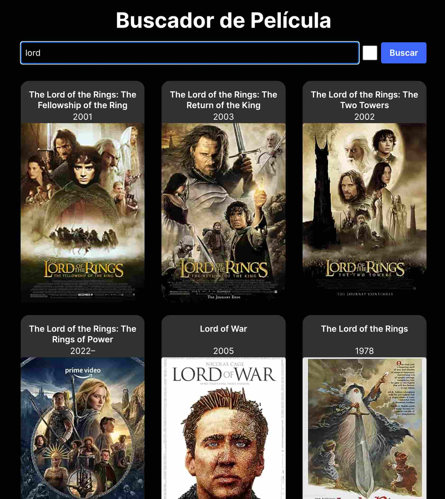

# Technical Test Junior (Reactjs)

## Description

This is a simple technical test junior using React with some requeriments also use [useStated](https://react.dev/reference/react/useState), [useEffect](https://react.dev/reference/react/useEffect), [customHooks](https://react.dev/learn/reusing-logic-with-custom-hooks), [useRef](https://react.dev/reference/react/useRef), [useMemo](https://react.dev/reference/react/useMemo), [useCallback](https://react.dev/reference/react/useCallback):

#### Requirements:

- It needs to display an input field to search for the movie and a search button.
- List the movies and display the title, year, and poster.
- Ensure the form works when searching.
- Make the movies display in a responsive grid.
- Perform data fetching from the API.
  
#### First Iteration:

- Prevent the same search from being made twice in a row.
- Make the search happen automatically while typing.
- Avoid continuous searching while typing (debounce).

Demo: [https://pruebatecnicajunior-reactjs.netlify.app/](https://pruebatecnicajunior-reactjs.netlify.app/)

## APIs

- OMDB Api: https://www.omdbapi.com/ 
- ApiKey: 565dce9f

## Tecnologies
- Library: [React](https://react.dev/)
- Bundle: [Vite](https://vitejs.dev/)
- Deploy: [Netlify](https://www.netlify.com/)
- Formater: [Eslint](https://eslint.org/)
- Dependence: [just-debounce-it](https://anguscroll.com/just/)
